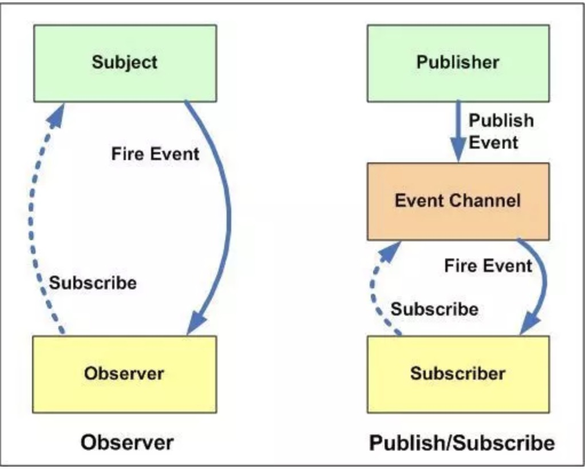

### 联系

观察者模式中主体和观察者是互相感知的，发布-订阅模式是借助第三方来实现调度的，发布者和订阅者之间互不感知



### 观察者模式

当对象间存在一对多关系时，则使用观察者模式（Observer Pattern）。比如，当一个对象被修改时，则会自动通知依赖它的对象。观察者模式属于行为型模式。

```javascript
// 定义：当对象之间存在一对多的依赖关系时，其中一个对象的状态发生改变，所有依赖它的对象都会收到通知，这就是观察者模式。
// 在观察者模式中，只有两种主体：目标对象 (Object) 和 观察者 (Observer)。宗门任务大殿就是目标对象，弟子们就是观察者。
class Observer {
  constructor(name) {
    this.name = name
  }

  update({ info }) {
    console.log(`${this.name}去任务大殿抢${info}任务`)
  }
}

class Subject {
  constructor() {
    this.list = []
  }

  addObserver(observer) {
    this.list.push(observer)
  }

  notify(task) {
    console.log('发布任务')
    this.list.forEach(item => item.update(task))
  }
}

const sub = new Subject()
const observer1 = new Observer('弟子1')
const observer2 = new Observer('弟子2')

sub.addObserver(observer1)
sub.addObserver(observer2)

sub.notify({ info: '猎杀时刻任务' })
```

### 发布-订阅模式

```javascript
class PubSub {
  constructor() {
    // 事件中心
    // 存储格式: warTask: [], routeTask: []
    // 每种事件(任务)下存放其订阅者的回调函数
    this.events = {}
  }
  // 订阅方法
  subscribe(type, cb) {
    if (!this.events[type]) {
      this.events[type] = []
    }
    this.events[type].push(cb)
  }
  // 发布方法
  publish(type, ...args) {
    if (this.events[type]) {
      this.events[type].forEach(cb => cb(...args))
    }
  }
  // 取消订阅方法
  unsubscribe(type, cb) {
    if (this.events[type]) {
      const cbIndex = this.events[type].findIndex(e => e === cb)
      if (cbIndex != -1) {
        this.events[type].splice(cbIndex, 1)
      }
    }
    if (this.events[type].length === 0) {
      delete this.events[type]
    }
  }
  unsubscribeAll(type) {
    if (this.events[type]) {
      delete this.events[type]
    }
  }
}

// 创建一个中介公司
let pubsub = new PubSub()

// 弟子一订阅战斗任务
pubsub.subscribe('warTask', function (taskInfo) {
  console.log('宗门殿发布战斗任务，任务信息:' + taskInfo)
})
// 弟子一订阅战斗任务
pubsub.subscribe('routeTask', function (taskInfo) {
  console.log('宗门殿发布日常任务，任务信息:' + taskInfo)
})
// 弟子三订阅全类型任务
pubsub.subscribe('allTask', function (taskInfo) {
  console.log('宗门殿发布五星任务，任务信息:' + taskInfo)
})

// 发布战斗任务
pubsub.publish('warTask', '猎杀时刻')
pubsub.publish('allTask', '猎杀时刻')

// 发布日常任务
pubsub.publish('routeTask', '种树浇水')
pubsub.publish('allTask', '种树浇水')
```
