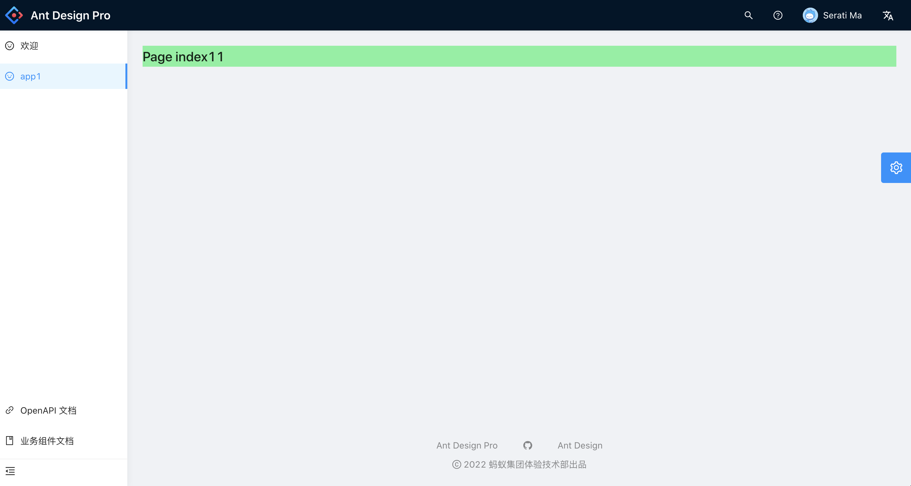

### 主应用配置

1. 安装主应用

```bash
yarn create umi main

/* ant-design-pro */
```

2. 安装 qiankun

```bash
yarn add qiankun
yarn add @umijs/plugin-qiankun -D
```

3. 注册子应用

在 config/confg.ts 文件下添加配置

```javascript
{
  ...
  qiankun: {
    master: {
      // 注册子应用信息
      apps: [
        {
          name: 'app1',  // 唯一 id
          entry: '//localhost:7001', // html entry
        },
      ],
    },
  },
}
```

4. 装载子应用
   在 config/routes.ts 路由文件下添加路由

```javascript
[
  {
    name: 'app1',
    icon: 'smile',
    path: '/app1',
    microApp: 'app1'
  }
];
```

### 子应用配置

1. 安装子应用

```bash
yarn create @umijs/umi-app app1
```

2. 安装 qiankun

```bash
yarn add qiankun
yarn add @umijs/plugin-qiankun -D
```

3. 插件注册
   在 .umirc.ts 文件中添加以下代码：

```javascript
qiankun: {
  slave: {
  }
}
```

添加后如下：

```javascript
import { defineConfig } from 'umi';

export default defineConfig({
  nodeModulesTransform: {
    type: 'none'
  },
  routes: [{ path: '/', component: '@/pages/index' }],
  fastRefresh: {},
  qiankun: {
    slave: {}
  }
});
```

4. 修改工程名称
   打开 package.json 文件，在第一行添加属性 "name":"app1"

5. 配置运行时生命周期钩子（可选）

在 src/app.ts 中添加代码（app.js 如果不存在请自行新建）

```javascript
export const qiankun = {
  // 应用加载之前
  async bootstrap(props) {
    console.log('app1 bootstrap', props);
  },
  // 应用 render 之前触发
  async mount(props) {
    console.log('app1 mount', props);
  },
  // 应用卸载之后触发
  async unmount(props) {
    console.log('app1 unmount', props);
  }
};
```

### 最终效果



避坑：若出现主项目界面 一直 loading 的情况，这是因为 loading 加载页挂载在 id 为“root”的 dom 节点下（antd pro 默认挂载节点为 root），而登录页挂载在 id 为“root-master”的 dom 节点下（@umijs/plugin-qiankun 插件默认挂载节点为 root-master）。总体而言，产生上述问题的原因就在于，使用 qiankun 插件后，更改了页面要渲染到的 dom 节点位置。
解决：在 config 文件中设置 mountElementId: 'root'

> 参考：[https://umijs.org/zh-CN/plugins/plugin-qiankun](https://umijs.org/zh-CN/plugins/plugin-qiankun)
